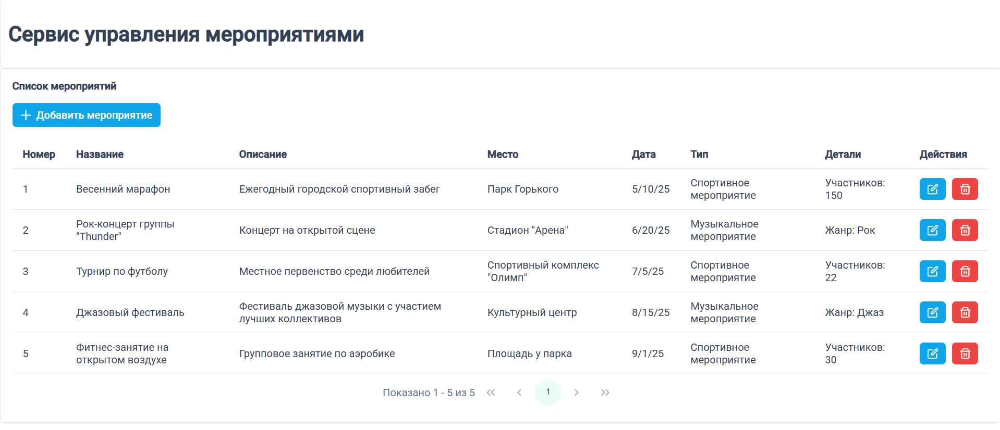
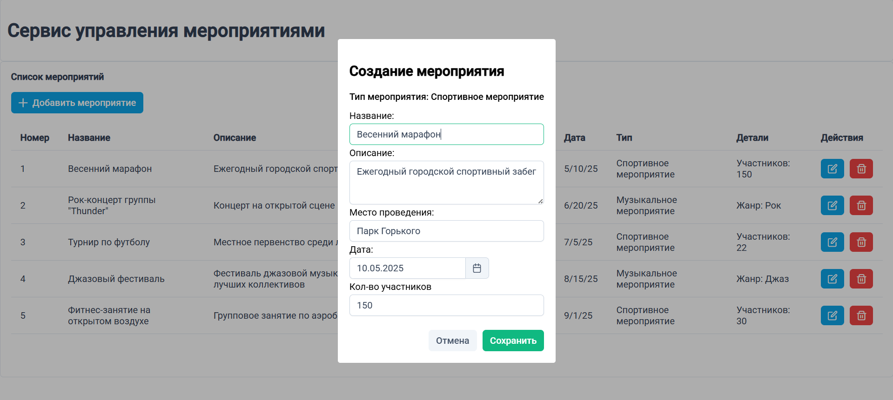
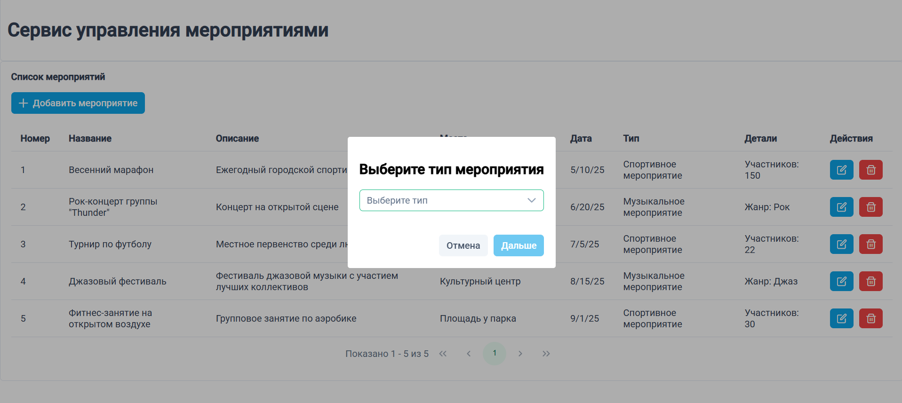
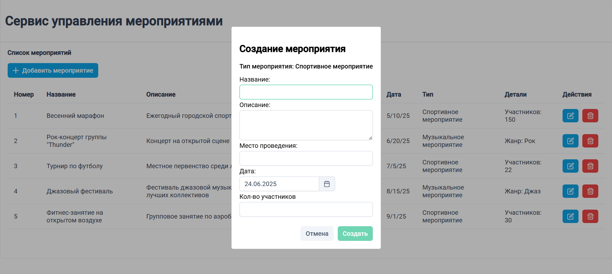
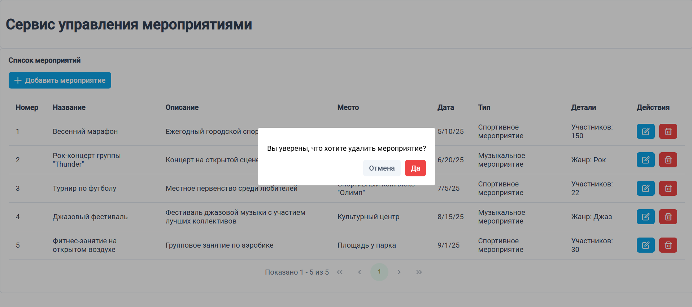

# Events Manager (Angular)

Приложение на Angular для управления мероприятиями. Пользователь может создавать, редактировать и удалять мероприятия двух типов (спорт и музыка) с использованием реактивных форм, диалоговых окон и динамических шаблонов.

## 👤 Разработчик

- Арина Слиж

## 🚀 Возможности

- Просмотр списка мероприятий
- Добавление мероприятий
- Редактирование мероприятий
- Удаление мероприятий

## 🧱 Технологии

- Angular 20
- TypeScript
- PrimeNG 19

## 📁 Запуск проекта

### Установить зависимости
npm install

### Запустить приложение
ng serve

## 🖼️ Скриншоты

### Список мероприятий

### Окно редактирования

### Создание нового мероприятия

#### Шаг 1.

#### Шаг 2.

### Диалог удаления

